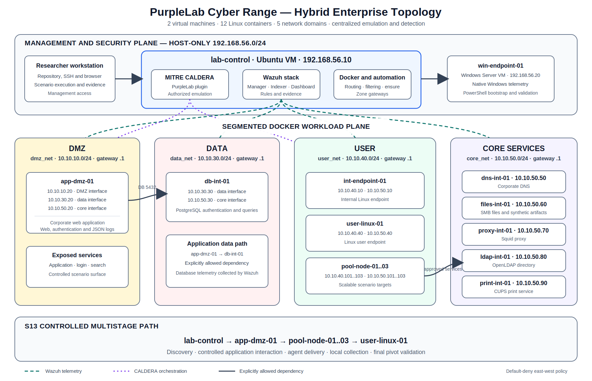
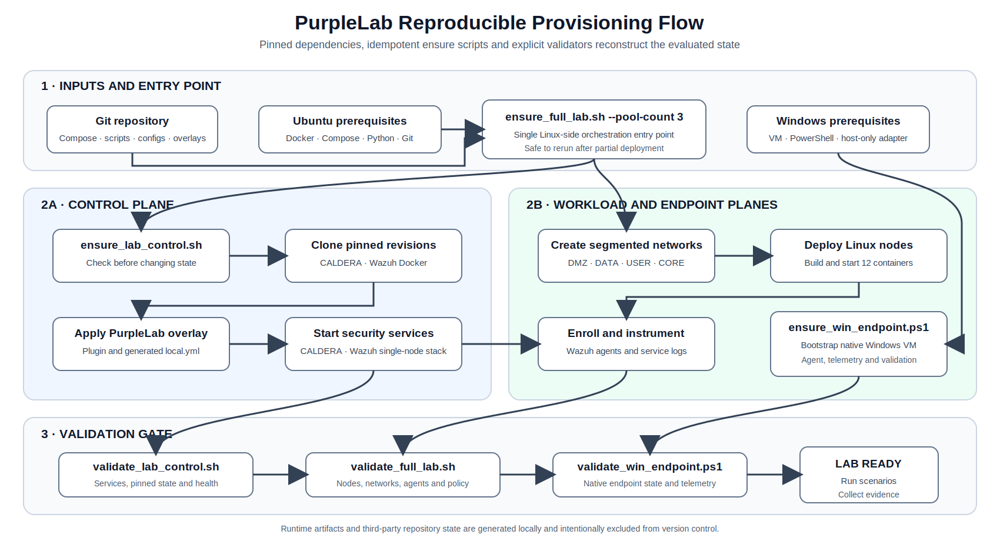
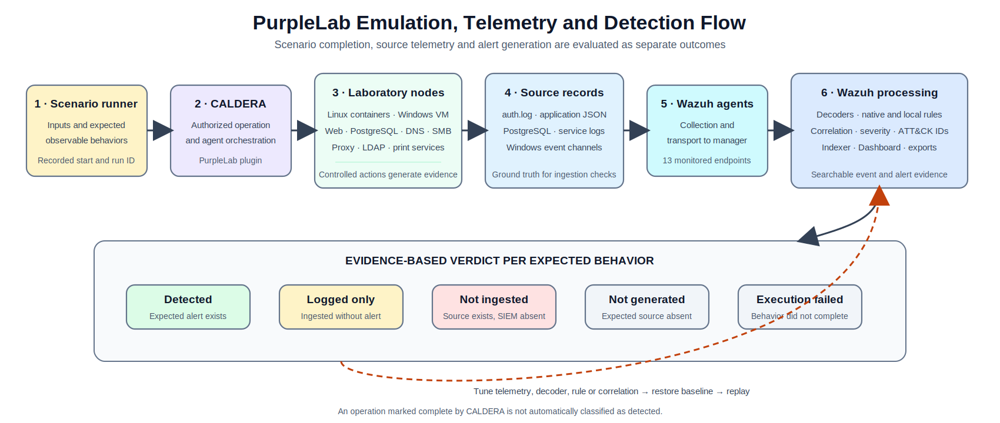

# PurpleLab Cyber Range

PurpleLab Cyber Range is a reproducible, locally deployable environment for authorized adversary emulation, detection validation, and security-monitoring exercises. It combines a segmented Docker-based enterprise lab, MITRE CALDERA for emulation and orchestration, and Wazuh for centralized telemetry collection and alerting.



## Key capabilities

- Reproducible deployment from a small set of host prerequisites.
- Two-VM hybrid architecture with twelve segmented Linux containers.
- DMZ, DATA, USER, CORE, and host-only management networks.
- Representative enterprise services including web, PostgreSQL, DNS, SMB, proxy, LDAP, and printing.
- MITRE CALDERA integration through the custom `purplelab` plugin.
- Wazuh agents, service-specific telemetry, local detection rules, and evidence exports.
- Linux and Windows bootstrap, validation, recovery, and `ensure` workflows.
- Isolated detection tests and multistage scenarios such as S13.

## Scope

This repository contains:

- Docker Compose definitions for the laboratory nodes and networks.
- Deployment, provisioning, recovery, and validation scripts.
- A custom MITRE CALDERA plugin under `overlays/caldera/plugins/purplelab/`.
- Scenario runners, validation scripts, and non-sensitive scenario inputs.
- Host bootstrap and provisioning automation for `lab-control`.
- Windows endpoint bootstrap and validation scripts.
- Wazuh configuration and PurpleLab detection content.

The repository does **not** vendor MITRE CALDERA or Wazuh Docker. Pinned upstream revisions are cloned automatically during provisioning, and the PurpleLab overlay is then applied locally.

## Architecture

The baseline contains two virtual machines and twelve Linux containers:

| Plane or zone | Nodes and services |
| --- | --- |
| Management | `lab-control`, `win-endpoint-01` |
| DMZ | `app-dmz-01` |
| DATA | `app-dmz-01` data interface, `db-int-01` |
| USER | `int-endpoint-01`, `user-linux-01`, `pool-node-01..n` |
| CORE | `dns-int-01`, `files-int-01`, `proxy-int-01`, `ldap-int-01`, `print-int-01`, node core interfaces |

Network domains:

| Network | CIDR | Purpose |
| --- | --- | --- |
| Host-only management | `192.168.56.0/24` | Researcher access and VM management |
| `dmz_net` | `10.10.10.0/24` | Application-facing surface |
| `data_net` | `10.10.30.0/24` | Application backend and database |
| `user_net` | `10.10.40.0/24` | User endpoints and scalable pool nodes |
| `core_net` | `10.10.50.0/24` | Internal services and shared backplane |

East-west traffic is deny-by-default. The deployment installs explicit exceptions for required dependencies such as DNS, application-to-database traffic, proxy use, approved internal services, and scenario-specific paths.

## Repository structure

```text
compose/                         Docker Compose definitions
configs/                         Images, entrypoints and service configuration
scripts/host/                    Host provisioning, deployment and validation
scripts/linux/                   Linux-side helper scripts
scripts/windows/                 Windows bootstrap and validation
scenarios/                       Scenario runners, inputs and validators
overlays/caldera/plugins/purplelab/
                                 Custom CALDERA plugin overlay
docs/images/                     Architecture and workflow diagrams
```

## Prerequisites

Recommended baseline:

- Ubuntu host for `lab-control`.
- Docker and Docker Compose.
- Python 3 and Git.
- VirtualBox for the Windows endpoint workflow.
- Internet access during provisioning to clone pinned upstream dependencies.

Review the configured host-only addresses before deployment if your environment does not use `192.168.56.0/24`.

## Provisioning

### Linux control VM and container lab

Run from the repository root on `lab-control`:

```bash
cd scripts/host
./ensure_full_lab.sh --pool-count 3
```

The ensure workflow checks the current state, provisions missing dependencies, clones the pinned CALDERA and Wazuh Docker revisions, applies the PurpleLab overlay, deploys the Linux nodes, enrolls monitoring agents, and runs validation.

### Windows endpoint

Run from the Windows VM:

```powershell
Set-ExecutionPolicy Bypass -Scope Process -Force
.\ensure_win_endpoint.ps1
```



## Validation

Run the primary Linux-side validators from `scripts/host/`:

```bash
./validate_lab_control.sh
./validate_full_lab.sh
```

On Windows:

```powershell
.\validate_win_endpoint.ps1
```

A deployment should not be treated as ready only because its containers are running. The validators check services, node identities, addressing, agent enrollment, telemetry inputs, and expected network policy.

## Scenarios and detection evidence

Scenario material is located under `scenarios/`. Runtime outputs and local evidence are intentionally excluded from version control. Baseline scenario runners and inputs are included, while advanced chains such as S13 may continue to evolve as detection coverage is refined.

PurpleLab separates scenario execution from detection outcomes. For each expected behavior, evidence is checked across source-event generation, Wazuh ingestion, alert generation, tuning, and replay.



## Generated and excluded content

The following are created locally and should normally remain outside version control:

- CALDERA and Wazuh runtime data.
- Generated credentials and local secrets.
- Scenario execution outputs and evidence exports.
- Third-party repository working trees.
- Container volumes, caches, logs, and temporary files.

## Access after deployment

After a successful bootstrap and validation, the main dashboards are available on the `lab-control` host-only address.

### Wazuh Dashboard

- URL: `https://192.168.56.10`
- User: `admin`
- Password: `SecretPassword`

The Wazuh dashboard uses a self-signed certificate in the default laboratory deployment, so the browser may display a certificate warning on first access.

### MITRE CALDERA

- URL: `http://192.168.56.10:8888`
- User: `red`

The CALDERA password is generated locally during bootstrap and should be read from:

```bash
thirdparty/caldera/conf/local.yml
```
The Linux bootstrap and validation helpers can also print the dashboard access information after deployment.

## Optional distribution artifacts

The Git repository is the primary reproducible artifact and should be treated as the source of truth for rebuilding the laboratory from scratch.

An OVA export of the validated `lab-control` VM may also be distributed as a convenience artifact for individuals who prefer importing a prebuilt control-plane image instead of reconstructing the environment from code.

Recommended use of the OVA:

- import the OVA into VirtualBox
- start the imported VM with the expected host-only adapter
- verify dashboard access
- run the Linux-side validators again

Suggested validation after importing the OVA:

```bash
cd scripts/host
./validate_lab_control.sh
./validate_full_lab.sh
```

## Validated baseline status

The baseline repository and the exported `lab-control` OVA were validated against the expected control-plane and segmented-lab checks.

A baseline should only be considered ready when the following succeed:

```bash
cd scripts/host
./validate_lab_control.sh
./validate_full_lab.sh
```

Passing validation confirms service reachability, agent presence, network segmentation expectations, and core laboratory dependencies. It does not imply that every scenario is fully detected by default; scenario execution and detection coverage remain separate evaluation outcomes.

## Upstream dependencies

MITRE CALDERA and Wazuh Docker remain separate upstream projects and retain their respective licenses. PurpleLab applies its own configuration, automation, scenarios, and plugin overlay after the pinned revisions are cloned.

## Research artifact

This repository accompanies the manuscript *A Reproducible Purple Team Laboratory for Validating Detections Across Heterogeneous Attack Surfaces*.

## License

Original PurpleLab code, automation, configurations, and scenarios are distributed under the license in [`LICENSE`](LICENSE). Third-party components and any files explicitly marked otherwise retain their original licenses.
